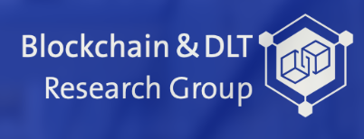

# Master's project Ben Murphy & Florian Rüeggsegger

<!-- PROJECT LOGO -->
 

    
  </a>

## About The Project

The Blockchain Observatory (BCO), a project by the Blockchain and Distributed Ledger Technologies
Group (BDLT) at the University of Zurich (UZH), aims to standardise data generated by various
blockchains. In this master’s project, we take a step towards this goal by building a data pipeline with
a focus on the blocks authored on the relay chain of the Polkadot network. The components that make
up the data pipeline are the following: An archive node of Polkadot, the Apache Kafka framework, the
persistent storage layers of Postgres and Neo4j and lastly the Apache Spark framework. The archive
node provides the full chain data, as well as newly validated blocks. The Apache Kafka framework
acts as an interface between the production of blocks and preprocessor scripts, which apply the custom
indexers for either the Postgres or Neo4j persistent data storage layers. The Apache Spark framework
provides a efficient query methods for the now structured data.

